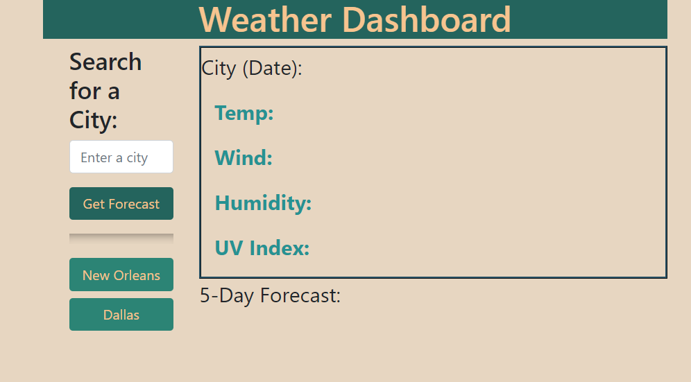
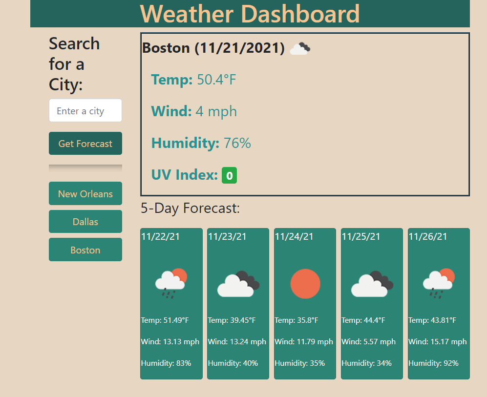

# Weather-Dashboard
Weather Dashboard allows the user to enter the name of a city and the current conditions and 5 day forecast are displayed. The city names are displayed as buttons and the user can quickly get the forecast for that city by clicking on the button.

## Author
- [@LindaWaterhouse](https://www.github.com/llwaterhouse)

## Description

* Upon start, an outline of the dashboard is displayed with an input field for the city name

* When the user clicks "Get Forecast", the name of the city and today's date is displayed with an icon reflecting the current weather.

* Today's temperature, humidity and windspeed are displayed.  The UV Index is displayed and is color coded depending on the potential risk of the UV.  Green is safe, yellow is moderate and red is dangerous.

* Below, the forecast for the next 5 days are displayed including the date, icon reflecting weather, temp, wind and humidity

* A button is created with the city's name. The button can be clicked at any time to get instant access to the current weather and forecast.

* The button's city names are saved in local storage and are restored when the application starts again.

* The UI is responsive and works at many different screen sizes

* a favicon was created and added so that the user can identify the dashboard's tab.

* a Bootstrap modal dialog will display any errors to the user

## Built With

* HTML
* CSS
* Javascript
* jQuery
* Bootstrap

## Prerequisites

If you want to edit this web page you must have a Github account, and have also downloaded Visual Studio Code.

[Create a Github account](https://github.com)

[Download Visual Studio](https://code.visualstudio.com/download/)

## Deliverables

### Screenshots

Initial screenshot with saved city buttons

Display of current weather and 5 day forecast

### Repository

[GitHub repository for this project](https://github.com/llwaterhouse/Weather-Dashboard

### Deployed Application

[The deployed GitPage Application](https://llwaterhouse.github.io/Survival-Quiz/)

## Acknowledgements

Rutgers Coding Bootcamp

## License
---

© 2021 Linda Waterhouse Consulting. Confidential and Proprietary. All Rights Reserved.

Permission is hereby granted, free of charge, to any person obtaining a copy of this software and associated documentation files (the "Software"), to deal in the Software without restriction, including without limitation the rights to use, copy, modify, merge, publish, distribute, sublicense, and/or sell copies of the Software, and to permit persons to whom the Software is furnished to do so, subject to the following conditions:

The above copyright notice and this permission notice shall be included in all copies or substantial portions of the Software.

THE SOFTWARE IS PROVIDED "AS IS", WITHOUT WARRANTY OF ANY KIND, EXPRESS OR IMPLIED, INCLUDING BUT NOT LIMITED TO THE WARRANTIES OF MERCHANTABILITY, FITNESS FOR A PARTICULAR PURPOSE AND NONINFRINGEMENT. IN NO EVENT SHALL THE AUTHORS OR COPYRIGHT HOLDERS BE LIABLE FOR ANY CLAIM, DAMAGES OR OTHER LIABILITY, WHETHER IN AN ACTION OF CONTRACT, TORT OR OTHERWISE, ARISING FROM, OUT OF OR IN CONNECTION WITH THE SOFTWARE OR THE USE OR OTHER DEALINGS IN THE SOFTWARE.

